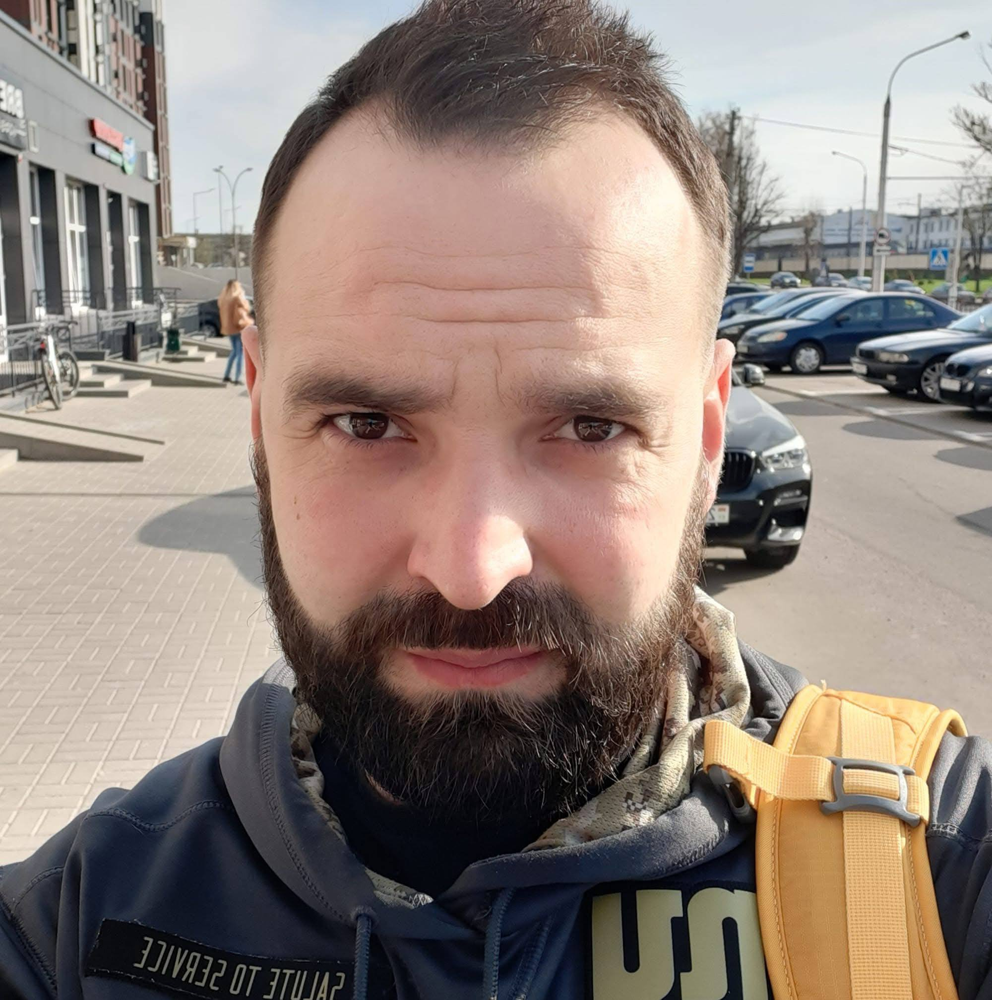

# Yauhen Buinitski

## Contscts
-Location:Cullera, Spain
-GitHub: [YauhenBuinitski](https://github.com)
-Discord: EujenioB
-Email: bujnickijauhen@gmail.com
-Telegram: @JauhenB
-LinkedIn: [Yauhen Buinitski] (https://www.linkedin.com/in/yauhen-buinitski/)

***

My name is Yauhen. I want to become a Developer because I want to lern a new pofession. This profession can help me work from any country in the futere. Before this, I had a different life. I finished Belarusisan State University  and worked as a history teacher in a scool. After that, I worked as a bartender. In 2019, my friend and I opened our own bar, but we had to close it after the events of August 2020 in Belarus. Then I worked for 3 years at a sawmill in Shclow, Belarus. Recently I moved to Spain and I am starting my life from the beginning. I am ready to study hard to get new skills. 

***

## My Skills

### Personal and Work Skills 
-Good communication and team work
-Experience in team management 
-Work in stressful and crisis situations
-Time management and organization
Public speaking and training people

### Tech Skils
-HTML5 and CSS
-Git and GitHub
-Markdown

***

## Education

-***GIUST BSU*** (2014 — 2017) — Master's Degree (Management and Economics)
-***Belarusian State University*** (2009 — 2014) — History Teacher Degree
-***Vilnius School of Human Rights*** (2012) — Short course about human rights

***

## Languages
-**Belarusian:** Native
-**Russian:** Bilingual
-**English:** B1 (Intermediate)
-**Spanish:** A2 (Basic)
-**Polish:** A2 (Basic)

